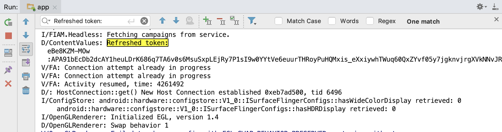

### Firebaseのデモを動かそうとして空回りした話

for shinjuku-mokumoku28 @ixap2i

--- 

### だれ？
@size[1em](- ixap2i - yama)

@size[0.8em](- メドケアというヘルステック系のスタートアップで働いています)

@size[0.8em](- もともとrails周りを触っていて、フレームワーク依存しない・スクリプト言語に依存しない技術力を身に付けたくて転職しました。)

---

### 何話すの？

@size[0.8em](- Firebaseのデモを触っていて全然再現ができなかった話)

@size[0.8em](- 公式のGithubを読んでいてもわからないことは往往にしてある😇)

---

### 背景
@size[0.8em](- ZOZOの中の方の記事を拝見して、「やっぱFirebaseいけてるやん…」という漠然とした理由から)

@size[0.8em](- https://qiita.com/tomohito_takahashi/items/fea4a931ad1734585d1c)

@size[0.8em](- とにかくなんでもいいからAndroidベースで何か作りたかった)

---

### 使用環境

@size[0.8em](- AndroidStudio - API28 :Android9.0(Pie))

@size[0.8em](- Firebase Messaging)

---

### Depricated😇

@size[0.8em](- 安易にcloneしたリポジトリを動かしてみようとしたらDeprecartedで動かそうと頑張ってしまった)
@size[0.8em](- 公式にクイックスタートのデモがあったが、やりたい事のリポジトリを見つけるのに時間がかかった)

---

### できた事

@size[0.8em](- 結局1からプロジェクトをスタートし、FirebaseのインスタンスIDを取得して環境構築しました)

@size[0.8em](- AndroidStudioはTools -> Firebaseからアカウントと同期してアプリのセットアップができますが、IDEから始めるTutorialは記載されているメソッド自体も古く、公式のドキュメントを見てtokenの作成を行いました。)

---

### 反省点

@size[0.8em](- 先にFirebaseプロジェクト内のドキュメントを参照していれば苦労はしなかった…)

@size[0.8em](- 手よりも目を動かした方がいい時もある😇)

--- 

### 続き

@size[0.8em](- https://github.com/ixap2i/FirebaseChatAppで頑張って続きを書きます😇)

@size[0.8em](- だいぶ手探り感あったので、次は余裕を持ってドキュメントの読み込みなどしながらコード書きたいです)
